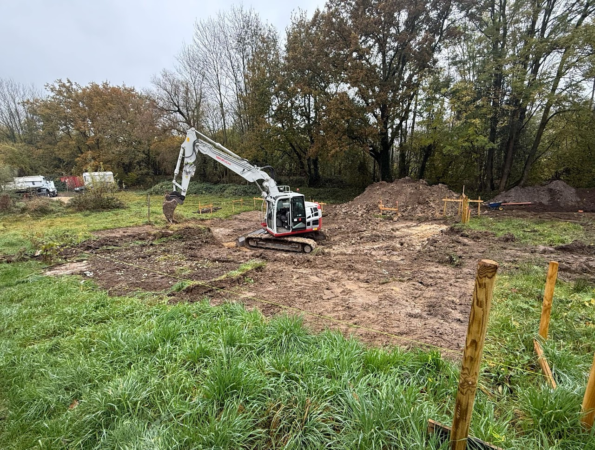
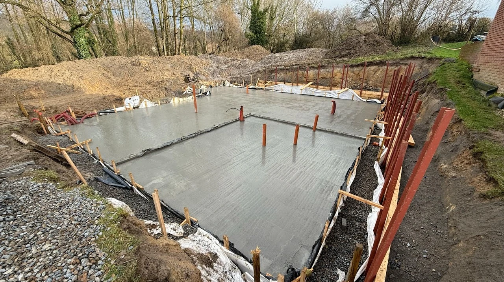
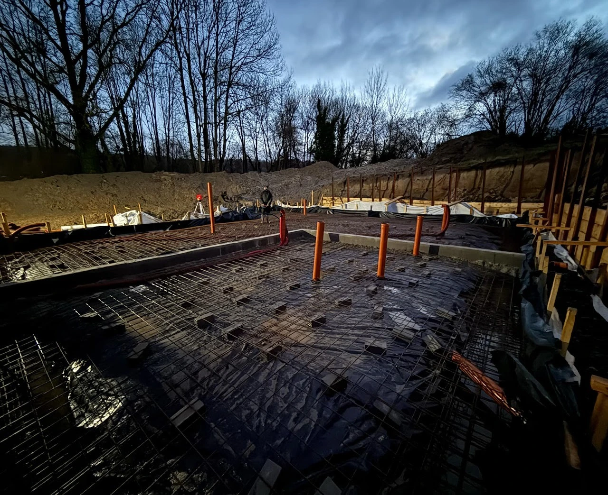
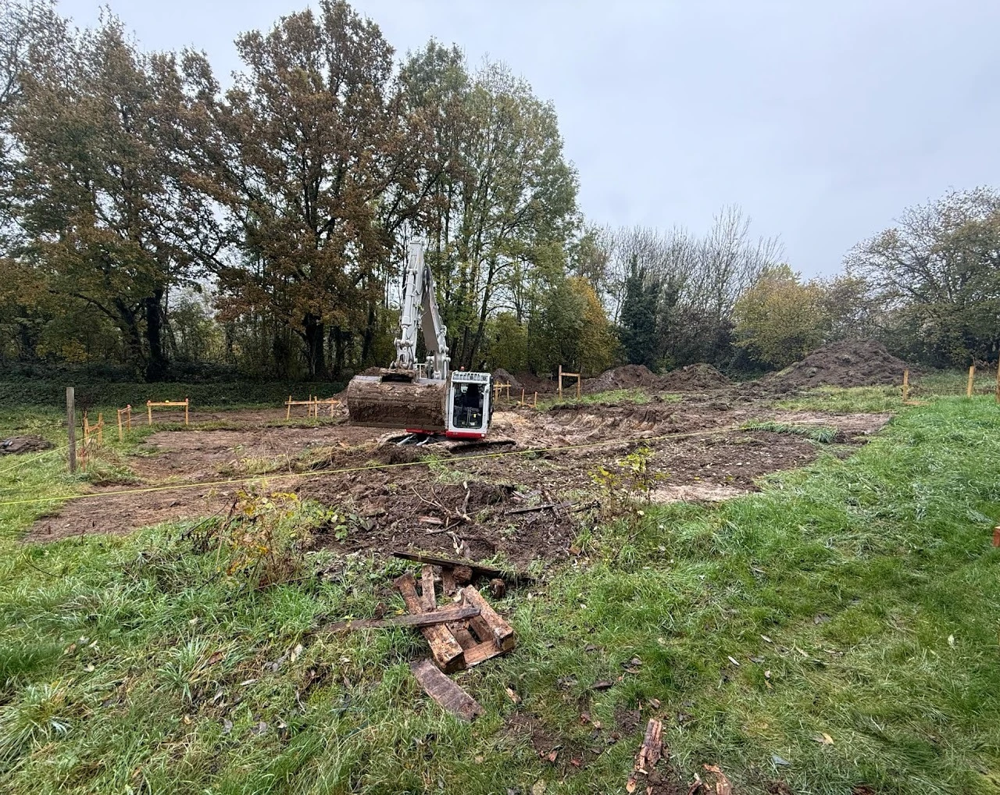
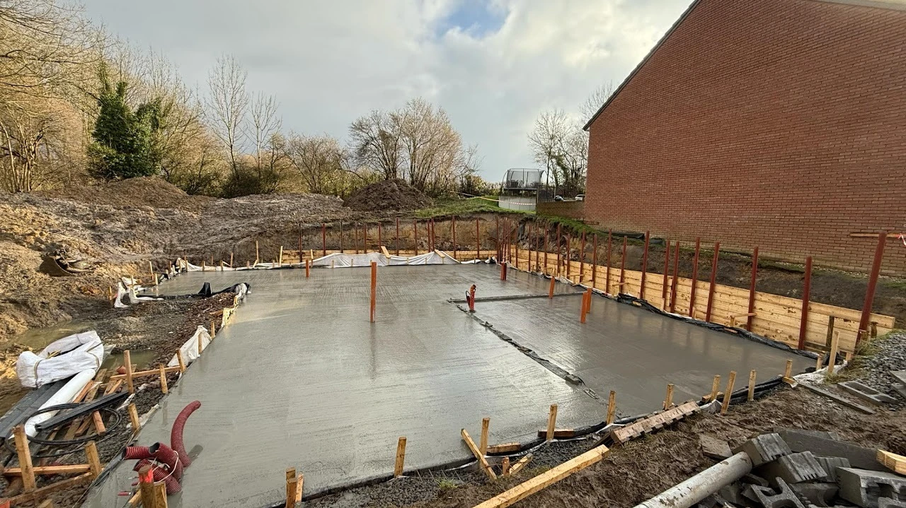
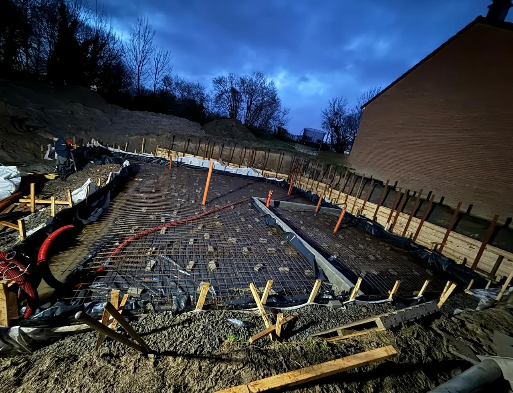
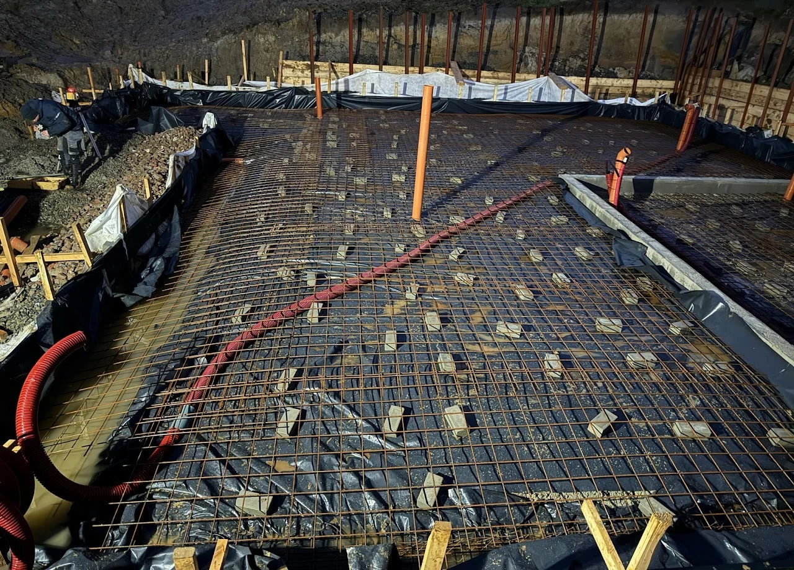
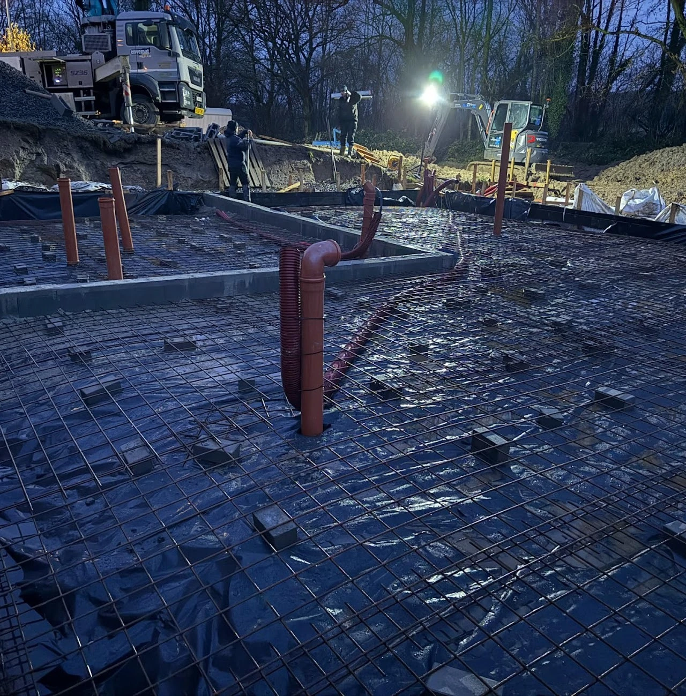

Pour le terrassement de ce projet, nous avons été surpris par des sources présentes sous le sol de ce terrain. Il était donc difficile de creuser sans s'enfoncer dans la boue. Nous avons mis en place des pompes, afin de vider en continu le "trou" des fondations.

NB : Nous réalisons également le gros œuvre de cette construction.

